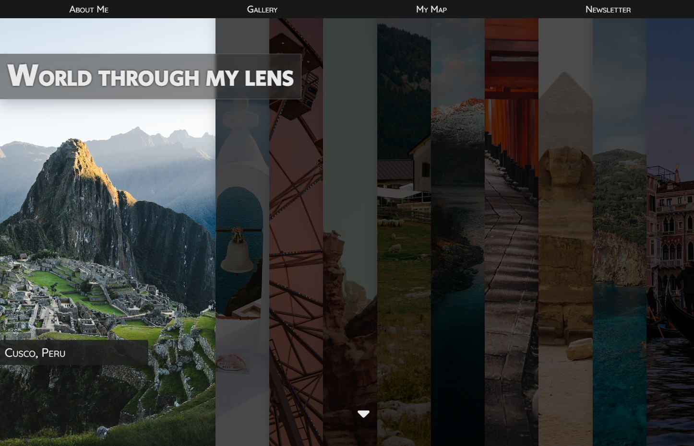
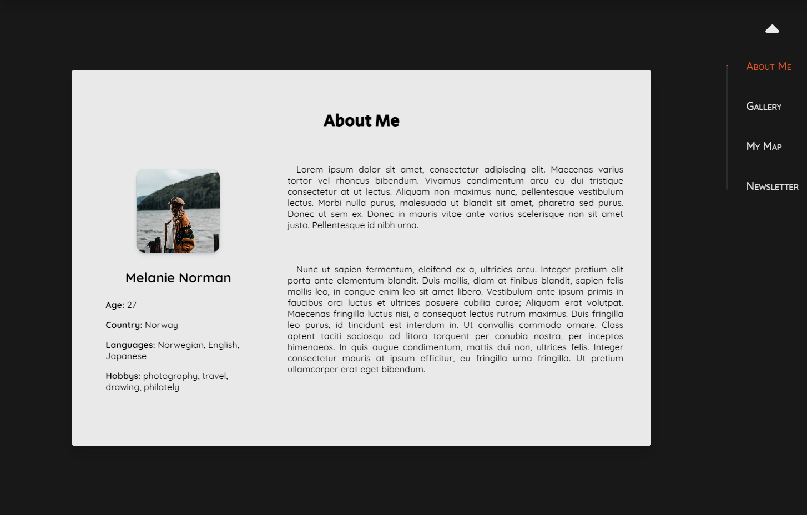
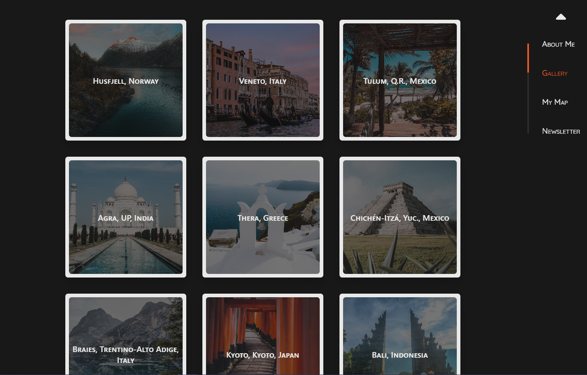

# Travel Photography Blog

Welcome to the Travel Photography Blog project repository! This repository contains the source code for a blog website dedicated to showcasing captivating travel photographs and inspiring stories from around the world.

## Table of Contents

- [About](#about)
- [Demo](#demo)
- [Features](#features)
- [Technologies Used](#technologies-used)
- [Installation](#installation)
- [Usage](#usage)
- [Contributing](#contributing)
- [License](#license)
- [Contact](#contact)

## About

The Travel Photography Blog is a web project aimed at bringing the beauty of travel destinations to life through stunning photographs and engaging narratives.

## Demo

Check out the live demo of the Travel Photography Blog: [https://b-na.github.io/travel_photography_blog/](https://b-na.github.io/travel_photography_blog/)

## Features

- Browse through a collection of captivating travel photographs.
- Read inspiring stories and travel experiences shared by fellow adventurers.
- User-friendly and responsive design for seamless browsing on various devices.
- Easy-to-use navigation for exploring different destinations and posts.

## Technologies Used

- HTML5
- CSS3
- SCSS
- JavaScript
- React

## Installation

To set up this project locally, follow these steps:

1. Clone the repository: `git clone https://github.com/b-na/travel_photography_blog.git`
2. Navigate to the project directory: `cd travel_photography_blog`

## Usage

1. Open the `index.html` file in your preferred web browser.
2. Explore the stunning travel photographs and enjoy the stories from different destinations.

## Contributing

Contributions are welcome! If you'd like to contribute to this project, please follow these steps:

1. Fork the repository.
2. Create a new branch for your feature: `git checkout -b feature-new-feature`
3. Make your changes and commit them: `git commit -m "Add new feature"`
4. Push to your branch: `git push origin feature-new-feature`
5. Create a pull request explaining your changes.

## License

This project is licensed under the [MIT License](LICENSE).

## Contact

If you have any questions, suggestions, or would like to connect, you can reach out to me:

- Email: binawagner.contact@gmail.com
- GitHub: [@b-na](https://github.com/b-na)

Feel free to explore the Travel Photography Blog and share your thoughts!
